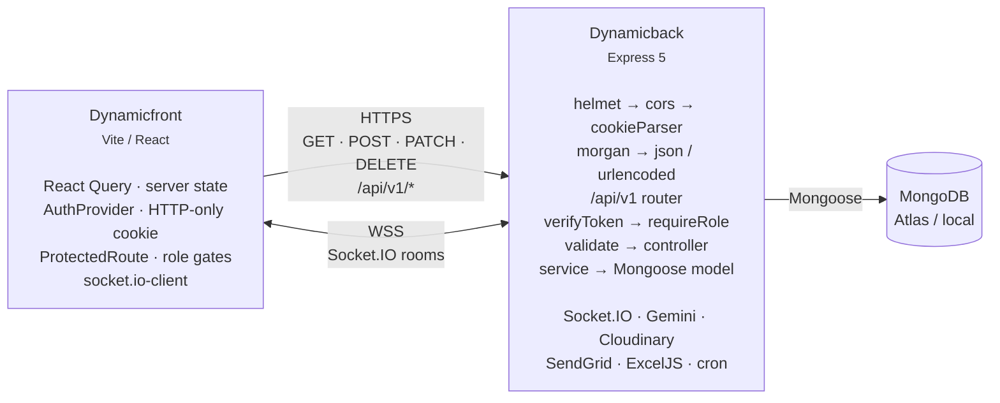

# DynamicGym

A full-stack gym management platform with a public marketing site, role-based dashboards for admins and students, real-time notifications, and Google Gemini–powered AI features (workout/diet plan generation, AI coach chat, and a natural-language analytics assistant over the gym's own MongoDB data).

This repository is a two-part monorepo. The two folders are **separate Git repositories** and are deployed independently.

| Folder | Package | Stack | Default port |
| --- | --- | --- | --- |
| [`Dynamicback/`](./Dynamicback) | `gym-backend` | Node.js, Express 5, Mongoose 9, MongoDB, Socket.IO | `5000` |
| [`Dynamicfront/`](./Dynamicfront) | `gym-frontend` | React 19, TypeScript 5.9, Vite 7, Tailwind CSS 3, TanStack Query | `5173` |

---

## Table of Contents

- [Features](#features)
- [Architecture](#architecture)
- [Tech Stack](#tech-stack)
- [Prerequisites](#prerequisites)
- [Getting Started](#getting-started)
- [Environment Variables](#environment-variables)
- [Project Structure](#project-structure)
- [API Reference](#api-reference)
- [Frontend Routes](#frontend-routes)
- [Data Model](#data-model)
- [Authentication & Authorization](#authentication--authorization)
- [Realtime Events](#realtime-events)
- [AI & RAG Features](#ai--rag-features)
- [Excel Import / Export](#excel-import--export)
- [Scheduled Jobs](#scheduled-jobs)
- [Deployment](#deployment)
- [Scripts](#scripts)
- [Known Issues & Technical Debt](#known-issues--technical-debt)

---

## Features

### Public / Marketing
- Landing page with scroll-aware navbar, animated hero counters, trainers, services, about, and an auto-rotating testimonial carousel.
- Public pages: achievements timeline + photo gallery, services, membership pricing, terms, privacy, contact.
- Anyone can submit a testimonial (with photo upload) — it lands in an admin moderation queue as `pending`.
- Public read endpoints: milestones, gallery images, approved testimonials.

### Student
- 4-step registration wizard (account → physical details → fitness goals → review) with password confirmation and a live preview.
- Self check-in for daily attendance (one record per day, enforced by a compound unique index).
- View assigned workouts and tick exercises complete; completion percentage recomputes on every toggle.
- Log body weight / BMI with a Recharts area trend; built-in BMI calculator that persists the result.
- Log daily macros (calories, protein, carbs, fat) with a Recharts pie breakdown and average macro split.
- Targeted announcements feed (all / own batch / direct).
- "Account under review" wait screen that auto-redirects the moment an admin approves the account (via Socket.IO).
- Floating **AI Coach** chat widget with persisted history.
- Request an AI-generated workout plan (persisted as a real `Workout`) and an AI diet recommendation.
- Edit profile and change password.

### Admin
- Dashboard overview: total students, pending approvals, active batches, attendance percentages, workout progress, recent activity.
- Student management: filter by status / batch / gender / blood group / active, paginated, with search; approve, soft-delete, reactivate, permanent-delete (cascades).
- Student drill-down page with inline editing and a **Gemini-generated progress narrative** (30-day attendance, metrics, workouts).
- Assign workouts to individual students, whole batches, or both — with real-time push and email notification.
- Workout monitoring: per-student completion progress.
- Attendance monitor with batch filter and 30-day baseline percentages.
- Announcements: compose for everyone, by batch, by individual, or batch+individual.
- Achievements manager: CRUD milestones, upload/delete Cloudinary gallery images.
- Testimonial moderation: approve / reject / delete.
- Excel bulk import of students and formatted progress export.
- **AI Assistant (RAG)** — ask questions in plain English ("which batch has the lowest attendance this month?") and get a synthesized answer plus the generated Mongo aggregation pipeline and sources.
- Profile management.

### Cross-cutting
- Real-time notifications over Socket.IO (approval status, workout assignment, announcements) surfaced as toasts.
- JWT in an `httpOnly` cookie — no token ever touches JavaScript.
- Layered backend (`route → controller → service → model`) with `express-validator`, role guards, a normalized error handler, and `helmet` + strict CORS.

---

## Architecture



**Request flow:** `server.js` → `/api/v1` router → `verifyToken` → `requireRole(...)` → express-validator chain → `validate` → controller (wrapped in `catchAsync`) → service (business logic, aggregation, side effects) → Mongoose model.

**Transport note:** the frontend calls the backend by absolute URL from `VITE_API_URL`. There is **no Vite dev proxy**, so CORS is mandatory on the server (`CLIENT_URL` must match the frontend origin exactly, with `credentials: true`).

**Naming note:** the backend folder is `Dynamicback` (not `Dynamicback`→`Backend`); the API prefix is `/api/v1` for every route, plus a `/health` endpoint at the root.

---

## Tech Stack

### Backend
| Package | Version | Purpose |
| --- | --- | --- |
| express | ^5.2.1 | HTTP framework (Express 5 — named-splat 404 syntax) |
| mongoose | ^9.2.1 | MongoDB ODM, aggregation pipelines |
| jsonwebtoken | ^9.0.3 | Stateless auth tokens |
| bcrypt | ^6.0.0 | Password hashing (cost factor 12) |
| socket.io | ^4.8.3 | Real-time events |
| @google/genai | ^2.2.0 | Gemini 2.5 Flash (plans, chat, summaries, RAG) |
| cloudinary | ^2.9.0 | Gallery + testimonial image hosting |
| @sendgrid/mail | ^8.1.6 | Transactional email (assignments, announcements) |
| exceljs | ^4.4.0 | `.xlsx` student import / progress export |
| express-validator | ^7.3.1 | Request validation |
| multer | ^2.0.2 | Multipart parsing (in-memory, 5 MB cap) |
| node-cron | ^4.2.1 | Nightly cleanup job |
| helmet, cors, morgan, cookie-parser, dotenv | — | Security, CORS, logging, cookies, env |
| nodemon | ^3.1.11 | Dev auto-restart |

### Frontend
| Package | Version | Purpose |
| --- | --- | --- |
| react / react-dom | ^19.2.0 | UI runtime |
| vite | ^7.3.1 | Dev server + build |
| typescript | ~5.9.3 | Strict type checking (`strict`, `noUnusedLocals`, `noUnusedParameters`, `erasableSyntaxOnly`) |
| @tanstack/react-query | ^5.90.21 | All server state, caching, invalidation |
| react-router-dom | ^7.13.0 | Client-side routing (35 route elements) |
| axios | ^1.13.5 | Single configured HTTP client |
| tailwindcss | ^3.4.19 | Styling with a custom neon-dark theme |
| recharts | ^3.7.0 | Area / pie / bar charts |
| lucide-react | ^0.575.0 | Icon set |
| antd | ^6.3.1 | `ConfigProvider` dark theme; used on 4 legal/auth pages |
| framer-motion | ^12.34.3 | Page and component animation |
| socket.io-client | ^4.8.3 | Realtime client |
| react-hot-toast | ^2.6.0 | Toasts |
| date-fns | ^4.1.0 | Date formatting |

---

## Prerequisites

- **Node.js 20+** (required — the backend has no `engines` field but depends on Express 5 and Mongoose 9)
- **npm 10+**
- **MongoDB** — a local instance or an Atlas cluster. A connection string is mandatory.
- Accounts / keys for the integrations you want to enable: **Google Gemini**, **Cloudinary**, **SendGrid**. Each is optional at boot except MongoDB and the JWT secret; features degrade gracefully (AI endpoints return a "not configured" error, email is skipped with a warning, uploads fail at call time).

---

## Getting Started

### 1. Clone

```bash
git clone https://github.com/suniltechs/Dynamicback.git   # backend
git clone <frontend-repo-url>                              # frontend
```

Place them side by side:

```
Dynamic_gym/
├── Dynamicback/
└── Dynamicfront/
```

### 2. Backend

```bash
cd Dynamicback
npm install
```

Create `.env` in `Dynamicback/`:

```ini
PORT=5000
MONGO_URI=mongodb+srv://<user>:<pass>@<cluster>.mongodb.net/dynamicgym
JWT_SECRET=replace-with-a-long-random-string
JWT_EXPIRES_IN=7d
CLIENT_URL=http://localhost:5173
NODE_ENV=development

GEMINI_API_KEY=
CLOUDINARY_CLOUD_NAME=
CLOUDINARY_API_KEY=
CLOUDINARY_API_SECRET=
SENDGRID_API_KEY=
SENDGRID_FROM_EMAIL=noreply@yourgym.com
```

Seed the first admin account (idempotent — it exits if any admin already exists):

```bash
npm run seed:admin
```

> Default seeded credentials: **`admin@gym.com` / `admin123`**. Change this immediately.

Start the server:

```bash
npm run dev     # nodemon, port 5000
# or
npm start       # plain node
```

Verify:

```bash
curl http://localhost:5000/health
# {"success":true,"message":"Server is running 🚀"}
```

### 3. Frontend

```bash
cd Dynamicfront
npm install
```

Create `.env` in `Dynamicfront/`:

```ini
VITE_API_URL=http://localhost:5000
```

Start the dev server:

```bash
npm run dev     # http://localhost:5173
```

Vite prints its actual port on startup. If it lands on anything other than `5173`, update `CLIENT_URL` in the backend `.env` and restart the backend, or CORS will reject every request.

### 4. First-run walkthrough

1. `npm run seed:admin` in the backend, then sign in at `http://localhost:5173/admin/login` with the seeded credentials.
2. Optionally import students from Excel at **Admin → Import / Export**, or let students self-register at `/register`.
3. New self-registered students are `pending`. Approve them at **Admin → Students → Approve**; the student's wait screen updates instantly over Socket.IO.
4. Assign a workout, post an announcement, and confirm the student's toast appears.

---

## Environment Variables

### Backend (`Dynamicback/.env`)

| Variable | Required | Default | Description |
| --- | --- | --- | --- |
| `PORT` | No | `5000` | HTTP port. |
| `MONGO_URI` | **Yes** | — | MongoDB connection string. No default; boot fails without it. |
| `JWT_SECRET` | **Yes** | — | Signing/verification secret for all tokens. |
| `JWT_EXPIRES_IN` | No | `7d` | Token lifetime (also the cookie `maxAge`). |
| `CLIENT_URL` | No | `http://localhost:5173` | The single allowed CORS origin, for both HTTP and Socket.IO. Must be the exact frontend origin. |
| `NODE_ENV` | No | — | Set to `production` to enable `secure` + `sameSite: "none"` cookies and to strip stack traces from error responses. |
| `GEMINI_API_KEY` | For AI | — | Google Gemini key. Absent ⇒ AI endpoints return 500 "AI service is not configured". |
| `CLOUDINARY_CLOUD_NAME` | For uploads | — | Cloudinary cloud name. |
| `CLOUDINARY_API_KEY` | For uploads | — | Cloudinary API key. |
| `CLOUDINARY_API_SECRET` | For uploads | — | Cloudinary API secret. |
| `SENDGRID_API_KEY` | For email | — | SendGrid key. Absent ⇒ emails are skipped with a console warning, never thrown. |
| `SENDGRID_FROM_EMAIL` | No | `noreply@gym.com` | Verified SendGrid sender. |

### Frontend (`Dynamicfront/.env`)

| Variable | Required | Default | Description |
| --- | --- | --- | --- |
| `VITE_API_URL` | **Yes** | `http://localhost:5000` | Base URL for both Axios HTTP and the Socket.IO client. Set to the deployed backend origin (e.g. `https://dynamicback-af3z.onrender.com/`) for production. |

> **Security posture:** the frontend `.env` intentionally contains **no secrets**. All `VITE_*` values are inlined into the client bundle at build time, so only public configuration may ever live there. The JWT is delivered via an `httpOnly` cookie that JavaScript cannot read, which is why no `VITE_JWT_SECRET` exists.

---

## Project Structure

```
Dynamic_gym/
├── README.md
│
├── Dynamicback/                          # Express API  (CommonJS)
│   ├── server.js                         # bootstrap: middleware → /api/v1 → /health → 404 → error handler
│   └── src/
│       ├── config/
│       │   ├── index.js                  # port, mongoUri, jwtSecret, jwtExpiresIn
│       │   ├── db.js                     # mongoose.connect(process.env.MONGO_URI)
│       │   ├── cloudinary.js             # Cloudinary v2 SDK config
│       │   └── socket.js                 # initSocket(server), getIO()
│       ├── routes/                       # 13 files, all mounted under /api/v1
│       ├── controllers/                  # 12 files — request/response only
│       ├── services/                     # 11 files — business logic, aggregations, side effects
│       ├── models/                       # 11 files, 12 Mongoose models
│       ├── middlewares/                  # auth, role, validate, errorHandler, upload, imageUpload
│       ├── validators/                   # 8 express-validator files
│       └── utils/                        # ApiError, catchAsync, email, cleanupTask, seedAdmin
│
└── Dynamicfront/                         # React SPA  (ESM + TypeScript)
    ├── index.html                        # SPA entry, mounts #root
    ├── vite.config.ts                    # @vitejs/plugin-react, `@` → ./src alias
    ├── tailwind.config.js                # neon-dark theme
    ├── postcss.config.js
    ├── eslint.config.js
    ├── tsconfig.json / .app.json / .node.json
    ├── public/                           # logo.png, _redirects (Netlify SPA fallback)
    └── src/
        ├── main.tsx                      # provider composition + QueryClient
        ├── App.tsx                       # ALL routes (react-router-dom v7)
        ├── api/axios.ts                  # the single HTTP client
        ├── types/user.ts
        ├── routes/ProtectedRoute.tsx     # auth + role + pending-status gate
        ├── hooks/                        # 11 TanStack Query hook modules (~60 call sites)
        ├── components/                   # DashboardLayout, AIChatWidget, NotificationProvider, …
        ├── features/
        │   ├── auth/                     # AuthProvider + useAuthUser
        │   ├── landing/components/       # Navbar, Hero, WhatWeOffer, Trainers, Testimonials, AboutUs, Footer
        │   └── student/components/       # BMICalculator
        └── pages/
            ├── public pages
            ├── admin/                    # 13 admin screens
            └── student/                  # 9 student screens
```

---

## API Reference

Base URL: `http://localhost:5000/api/v1` · Auth: `httpOnly` cookie named `token`, or `Authorization: Bearer <token>`.

Every response follows `{ success, data | message, ... }`. Errors return `{ success: false, message, errors?, stack? }` (the `stack` is development-only).

Legend: 🔓 public · 🔒 any authenticated user · 👤 student only · 🛡️ admin only

### Auth — `/api/v1/auth`
| Method | Path | Access | Description |
| --- | --- | --- | --- |
| POST | `/auth/register` | 🔓 | Register a student (`role: student`, `status: pending`). Sets the auth cookie. |
| POST | `/auth/admin-login` | 🔓 | Admin-only login (rejects non-admins). |
| POST | `/auth/student-login` | 🔓 | Student-only login; `pending` students may sign in. |
| GET | `/auth/me` | 🔒 | Current user. Returns 403 `ACCOUNT_DEACTIVATED` when `isActive === false`. |
| POST | `/auth/logout` | 🔓 | Clears the cookie. |
| POST | `/auth/change-password` | 🔒 | Requires the current password; re-hashes automatically. |

### Users — `/api/v1/users` (admin only, except the last row)
| Method | Path | Description |
| --- | --- | --- |
| GET | `/users` | 🛡️ Paginated list. Query: `status, batch, gender, bloodGroup, isActive, name, page, limit` (limit 1–100). |
| GET | `/users/stats` | 🛡️ `{ totalStudents, pendingApprovals, activeBatches }`. |
| GET | `/users/batches` | 🛡️ Distinct batch names of approved + active students. |
| GET | `/users/export` | 🛡️ Streams a styled `student_progress.xlsx`. |
| POST | `/users/import` | 🛡️ Multipart `file` (`.xlsx`/`.xls`, ≤5 MB). |
| PATCH | `/users/:id/approve` | 🛡️ Sets `status: approved` and pushes a Socket.IO `statusUpdated`. |
| GET | `/users/:id` | 🛡️ Single student detail. |
| PATCH | `/users/:id` | 🛡️ Admin edit (whitelisted fields). |
| DELETE | `/users/:id` | 🛡️ **Soft** delete (`isActive: false`). |
| PATCH | `/users/:id/reactivate` | 🛡️ Restores a soft-deleted student. |
| DELETE | `/users/:id/permanent` | 🛡️ Hard delete + cascade (attendance, diet, metrics, workouts; `$pull` from announcements). |
| PATCH | `/users/profile` | 🔒 Self-service profile update. |

### Workouts — `/api/v1/workouts`
| Method | Path | Access | Description |
| --- | --- | --- | --- |
| GET | `/workouts` | 🛡️ | 50 most recent, with `assignedTo`/`assignedBy` populated. |
| POST | `/workouts` | 🛡️ | Bulk-assign to student IDs and/or batches. Socket + email. |
| GET | `/workouts/my` | 👤 | The signed-in student's workouts. |
| PATCH | `/workouts/:id/complete` | 👤 | Toggle one exercise; recomputes `completionStatus`. |

### Attendance — `/api/v1/attendance`
| Method | Path | Access | Description |
| --- | --- | --- | --- |
| POST | `/attendance` | 👤 | Check in for today (one per day). |
| GET | `/attendance/my` | 👤 | `{ totalDays, records }`. |
| GET | `/attendance/admin` | 🛡️ | Per-student totals and percentages (30-day baseline), optional `batch` filter. |

### Metrics — `/api/v1/metrics`
| Method | Path | Access | Description |
| --- | --- | --- | --- |
| POST | `/metrics` | 👤 | Log weight (≥1) and optional BMI (≥0). |
| GET | `/metrics/my` | 👤 | History plus an aggregation summary. |
| GET | `/metrics/:studentId` | 🛡️ | A student's metrics. |
| DELETE | `/metrics/:id` | 👤 | Delete one of your own entries. |

### Diet — `/api/v1/diet`
| Method | Path | Access | Description |
| --- | --- | --- | --- |
| POST | `/diet` | 👤 | Log calories / protein / carbs / fat. |
| GET | `/diet/my` | 👤 | Diet logs. |
| GET | `/diet/macros` | 👤 | Averages and percentage split (4/4/9 kcal per gram). |

### Announcements — `/api/v1/announcements`
| Method | Path | Access | Description |
| --- | --- | --- | --- |
| POST | `/announcements` | 🛡️ | Create for `all`, `batch`, `individual`, or `both`. Socket + email fan-out. |
| GET | `/announcements/my` | 🔒 | Admins see all; students see `all` + their batch + direct messages. |
| PATCH | `/announcements/:id` | 🛡️ | Edit. |
| DELETE | `/announcements/:id` | 🛡️ | Delete. |

### Exercises — `/api/v1/exercises`
| Method | Path | Access | Description |
| --- | --- | --- | --- |
| GET | `/exercises` | 🔒 | Flat array of unique exercise names (autocomplete source). |

### Achievements — `/api/v1/achievements`
| Method | Path | Access | Description |
| --- | --- | --- | --- |
| GET | `/achievements/milestones` | 🔓 | Ordered milestones. |
| POST | `/achievements/milestones` | 🛡️ | Create (auto-assigns `order` from the current count). |
| PATCH | `/achievements/milestones/:id` | 🛡️ | Update. |
| DELETE | `/achievements/milestones/:id` | 🛡️ | Delete. |
| GET | `/achievements/gallery` | 🔓 | Ordered gallery images. |
| POST | `/achievements/gallery` | 🛡️ | Multipart `image` (≤5 MB) → Cloudinary `dynamic-gym/gallery`, 800×600 fill. |
| DELETE | `/achievements/gallery/:id` | 🛡️ | Destroys the Cloudinary asset, then the row. |

### Testimonials — `/api/v1/testimonials`
| Method | Path | Access | Description |
| --- | --- | --- | --- |
| GET | `/testimonials/public` | 🔓 | Approved only, ordered by `order` then `createdAt`. |
| POST | `/testimonials` | 🔓 | Public submission with image (Cloudinary `dynamic-gym/testimonials`, 400×400) → `pending`. |
| GET | `/testimonials` | 🛡️ | All, including pending and rejected. |
| PATCH | `/testimonials/:id/status` | 🛡️ | `pending` / `approved` / `rejected`. |
| DELETE | `/testimonials/:id` | 🛡️ | Destroys the Cloudinary asset, then the row. |

### AI — `/api/v1/ai` (authenticated; no role guard — see [Known Issues](#known-issues--technical-debt))
| Method | Path | Description |
| --- | --- | --- |
| POST | `/ai/generate-plan` | Gemini → 1-day workout + diet plan. **Persists** a `Workout` (`batch: "AI Generated"`, `assignedBy: self`) and a `Diet` entry. |
| GET | `/ai/chat/history` | Last 50 chat messages for the caller. |
| POST | `/ai/chat/message` | Gemini chat with a 10-message context window; stores user + model turns. |
| POST | `/ai/suggest-exercises` | 5–8 exercise suggestions from the latest metrics/workouts of up to 5 students. |
| GET | `/ai/admin/student-summary/:id` | Gemini narrative of a student's progress (30-day attendance, metrics, workouts). |
| POST | `/ai/diet-recommendation` | 1-day meal plan (breakfast/lunch/dinner/snacks + macros). Not persisted. |

### RAG — `/api/v1/rag` (admin only, enforced at the router level)
| Method | Path | Description |
| --- | --- | --- |
| POST | `/rag/ask` | Natural-language question → Mongo aggregation → synthesized answer. |
| GET | `/rag/history` | Last 50 RAG conversations for the admin. |
| DELETE | `/rag/history` | Clear the admin's RAG history. |

### System
| Method | Path | Description |
| --- | --- | --- |
| GET | `/health` | Liveness probe. |
| ALL | `/*` | 404 JSON fallback. |

---

## Frontend Routes

### Public
| Path | Page | Notes |
| --- | --- | --- |
| `/` | `LandingPage` | Navbar, Hero, WhatWeOffer, Trainers, Testimonials, AboutUs, Footer |
| `/achievements` | `AchievementsPage` | Milestone timeline + gallery (public API) |
| `/services` | `ServicesPage` | Service catalogue |
| `/membership` | `MembershipPage` | Pricing tiers |
| `/terms` | `TermsPage` | Legal |
| `/privacy` | `PrivacyPage` | Legal |
| `/contact-us` | `ContactUs` | Form composes a WhatsApp deep link; no backend call |
| `/login` | `LoginPage` | Student sign-in |
| `/admin/login` | `AdminLoginPage` | Admin sign-in |
| `/register` | `RegisterPage` | 4-step wizard (largest file in the app) |
| `/unauthorized` | `UnauthorizedPage` | 403 role-mismatch screen |
| `/account-status` | `AccountStatusPage` | Deactivated notice; reads `?status=` |
| `/waiting-approval` | `PendingApproval` | Student-only; auto-redirects on Socket.IO approval |

### Admin — `/admin` (gated `allowedRoles={["admin"]}`)
| Path | Page |
| --- | --- |
| `/admin` | `AdminOverview` — KPIs, pending approvals, attendance, workout progress |
| `/admin/students` | `StudentManagement` — filter, paginate, approve, soft/hard delete |
| `/admin/students/:id` | `StudentDetails` — drill-down, inline edit, AI summary |
| `/admin/attendance` | `AttendanceMonitor` |
| `/admin/workouts` | `AssignWorkout` — bulk assign, AI exercise suggestions |
| `/admin/monitoring` | `WorkoutMonitoring` |
| `/admin/announcements` | `Announcements` |
| `/admin/import-export` | `ImportExport` |
| `/admin/achievements` | `ManageAchievements` |
| `/admin/testimonials` | `AdminTestimonials` |
| `/admin/ai-assistant` | `AdminRAGChat` — shows answer, sources, generated pipeline, errors |
| `/admin/profile` | `AdminProfile` |

### Student — `/student` (gated `allowedRoles={["student"]}`)
| Path | Page |
| --- | --- |
| `/student` | `StudentOverview` |
| `/student/workouts` | `MyWorkouts` |
| `/student/metrics` | `MyMetrics` — Recharts `AreaChart` |
| `/student/diet` | `MyDiet` — Recharts `PieChart` + AI recommendation |
| `/student/attendance` | `MyAttendance` — Recharts `BarChart` |
| `/student/bmi` | `BMICalculatorPage` |
| `/student/announcements` | `MyAnnouncements` |
| `/student/profile` | `StudentProfile` |

`*` redirects to `/login`.

**Provider nesting** (`src/main.tsx`): `StrictMode → QueryClientProvider → BrowserRouter → ConfigProvider (antd dark) → AuthProvider → NotificationProvider → App → Toaster`.

---

## Data Model

12 models across 11 files. All use `{ timestamps: true }`.

| Model | File | Key fields |
| --- | --- | --- |
| **User** | `models/User.js` | `name`, `email` (unique, lowercase, regex), `password` (`select: false`), `phone`, `role` (`admin`/`student`), `status` (`pending`/`approved`), `batch`, `profilePicture`, `gymName`, `address`, `contactPhone`, `gender` (`Male`/`Female`/`Others`), `fatherName`, `dob`, `age`, `height` (cm), `weight` (kg), `fitnessGoals[]` (7-value enum), `entryAmount`, `bloodGroup`, `emergencyContact`, `isActive`. Pre-`save` bcrypt hook (cost 12) + `comparePassword`. |
| **Workout** | `models/Workout.js` | `assignedTo`, `batch`, `assignedBy` (required), `exercises[]` `{name, reps, sets}` (non-empty), `startDate` (required), `endDate`, `completionStatus` (0–100), `completedExercises[]`. Indexed on `{assignedTo, startDate}` and `{batch, startDate}`. |
| **Attendance** | `models/Attendance.js` | `studentId`, `date` (defaults to local midnight), `status` (`present`). **Compound unique** `{studentId, date}` — one check-in per day. |
| **Metric** | `models/Metric.js` | `studentId`, `weight` (≥1, required), `bmi` (≥0), `date`. Indexed `{studentId, date}`. |
| **Diet** | `models/Diet.js` | `studentId`, `calories`/`protein`/`carbs`/`fat` (all ≥0, required), `date`. Indexed `{studentId, date}`. |
| **Announcement** | `models/Announcement.js` | `title`, `message`, `target` (`all`/`batch`/`individual`/`both`), `batches[]`, `assignedTo[]`, `createdBy`. Indexed `{target, createdAt}`. |
| **Exercise** | `models/Exercise.js` | `name` (unique, trimmed) — the exercise-name autocomplete dictionary. |
| **Milestone** | `models/Achievement.js` | `year`, `title`, `description`, `order`, `createdBy`. |
| **GalleryImage** | `models/Achievement.js` | `imageUrl`, `publicId`, `caption`, `order`, `createdBy`. |
| **Testimonial** | `models/Testimonial.js` | `name`, `role`, `review`, `rating` (1–5), `imageUrl`, `publicId`, `status` (`pending`/`approved`/`rejected`), `order`. |
| **ChatMessage** | `models/ChatMessage.js` | `studentId`, `role` (`user`/`model`/`system`), `content`. |
| **RagConversation** | `models/RagConversation.js` | `adminId`, `question`, `generatedQuery {collection, operation, pipeline}`, `queryResults`, `answer`, `sources[]`, `error`. |

`models/Achievement.js` is the only file exporting two models: `{ Milestone, GalleryImage }`.

---

## Authentication & Authorization

**Token lifecycle.** `authService.generateToken` signs `{ userId, role }` with `JWT_EXPIRES_IN` (default `7d`). The controller sets it as an `httpOnly` cookie named `token`:

```js
{
  httpOnly: true,
  secure: process.env.NODE_ENV === "production",
  sameSite: process.env.NODE_ENV === "production" ? "none" : "lax",
  maxAge: 7 * 24 * 60 * 60 * 1000,
}
```

**Verification** (`src/middlewares/auth.js`) checks the cookie first, then falls back to `Authorization: Bearer <token>`. On success it sets `req.user = { userId, role }`. There is no database lookup, so **a role change requires re-login** for the new role to take effect.

**Client side.** Axios uses `withCredentials: true`. There is **no token in `localStorage` or `sessionStorage` anywhere** — the browser never exposes it to JavaScript. A 401 response interceptor hard-redirects to `/login` (skipped on `/`, `/login`, `/admin/login`, `/register`, `/unauthorized`).

**Role matrix.**

| Area | Student | Admin |
| --- | :---: | :---: |
| Landing / legal / public pages | ✅ | ✅ |
| Own workouts, mark complete | ✅ | — |
| Own metrics, diet, attendance, BMI | ✅ | — |
| Own profile, change password | ✅ | ✅ |
| Read announcements | ✅ | ✅ |
| AI chat / plan / diet recommendation | ✅ | ✅ |
| RAG assistant | ❌ | ✅ |
| Manage students, approve, delete | ❌ | ✅ |
| Assign / monitor workouts | ❌ | ✅ |
| Attendance monitor | ❌ | ✅ |
| Create / edit / delete announcements | ❌ | ✅ |
| Milestones, gallery, testimonial moderation | ❌ | ✅ |
| Excel import / export | ❌ | ✅ |
| View any student's metrics | ❌ | ✅ |

**Role gate** (`ProtectedRoute`): loading → full-screen spinner; not authenticated → `/login`; wrong role → `/unauthorized`; student with `status: "pending"` → `/waiting-approval`; approved student still sitting on `/waiting-approval` → `/student`.

---

## Realtime Events

Socket.IO is attached to the same HTTP server. CORS uses the same `CLIENT_URL`.

| Direction | Event | Payload / room | Effect |
| --- | --- | --- | --- |
| client → server | `join` | `{ userId }` | Join a private room named by raw user id. Emitted on `connect`. |
| client → server | `joinBatch` | `{ batch }` | Join room `batch:<name>`. Emitted when the user has a batch. |
| server → room | `statusUpdated` | Student id | An admin approved the account. `PendingApproval` refetches and redirects. |
| server → room | `workoutAssigned` | Assignment payload | Toast + invalidate the `myWorkouts` query. |
| server → room | `announcement` | Announcement payload | Toast + invalidate `myAnnouncements`. |

`NotificationProvider` translates these into `react-hot-toast` messages and React Query cache invalidations.

---

## AI & RAG Features

All AI runs on **Google Gemini 2.5 Flash** via `@google/genai`. JSON responses are recovered by stripping markdown code fences.

### Feature endpoints
- **Plan generation** — one-day workout + diet plan built from the student's metrics and fitness goals. The workout half is **persisted** so it appears in normal workout views.
- **Coach chat** — conversational endpoint with a 10-message sliding context window; every turn is stored in `ChatMessage`.
- **Exercise suggestions** — 5–8 suggestions grounded in the latest metrics and workouts of up to 5 students.
- **Student summary** — a narrative progress report for the admin's student drill-down.
- **Diet recommendation** — a single-day meal plan with macro targets. Not persisted.

### The RAG assistant (`src/services/ragService.js`)
A five-stage pipeline:

1. **Context** — pull the admin's last 5 question/answer pairs.
2. **Query generation** — Gemini converts the question into `{ collection, operation: "aggregate", pipeline: [...] }` using a hand-written `SCHEMA_CONTEXT` describing all 11 queryable collections, plus rules (`$lookup` for joins, `ISODate(...)` for dates, always `$limit: 20`).
3. **Safety rails** —
   - `RESTRICTED_TOPICS` (credentials/secrets, file extensions, authn/authz, infra, DB internals, PII, internal business data, internal APIs, logs, AI/ML assets, folder listings) force a direct refusal instead of a query.
   - `ALLOWED_COLLECTIONS` allowlist; anything else throws `Access denied`.
   - The serialized pipeline is scanned for write operators (`$out`, `$merge`, `$set`, `$unset`, `$rename`, `delete*`, `insert*`, `update*`, `drop`, `remove`) and rejected as a `Safety violation`.
   - `maxTimeMS: 10000`; results truncated to 8000 characters for the model and 10 records when stored.
   - `parseDatesInPipeline()` recursively converts ISO date strings into real `Date` objects.
4. **Synthesis** — Gemini writes a plain-text, markdown-free answer under 400 words from those results.
5. **Persist** — store the question, generated query, results, answer, `sources` (including `$lookup.from` collections), and any error.

The admin UI (`/admin/ai-assistant`) shows the answer alongside the generated collection, pipeline, source counts, and any error.

> **Security note:** the RAG assistant is powerful by design. The allowlist and write-operator blocklist are the load-bearing controls — any change to `ALLOWED_COLLECTIONS` or the blocklist should be treated as a security-sensitive edit.

---

## Excel Import / Export

**Import** — `POST /api/v1/users/import`, multipart field `file`, `.xlsx`/`.xls` only, 5 MB max.

| Column | Field | Required |
| --- | --- | --- |
| A | Name | ✅ |
| B | Email | ✅ (used as the unique key) |
| C | Phone | — |
| D | Batch | — |

Row 1 is treated as a header. Imported users get `role: student`, `status: pending`, `isActive: true`, and the password **`Gym@1234`**. Insertion uses `ordered: false`, so duplicate emails are skipped rather than aborting the whole batch.

**Export** — `GET /api/v1/users/export` streams `student_progress.xlsx` with a styled header row:

Student ID · Name · Father's Name · Gender · DOB · Age · Height (cm) · Weight (kg) · Blood Group · Email · Contact Number · Emergency Contact · Address · Current Batch · Entry Amount · Fitness Goals

---

## Scheduled Jobs

One `node-cron` job, registered at boot by `initCleanupTask()` in `src/utils/cleanupTask.js`:

| Schedule | Action |
| --- | --- |
| `0 0 * * *` (daily at midnight) | Delete all `Workout` documents older than 7 days. |

> This is unconditional and unfiltered — it removes admin-assigned multi-day plans and AI-generated plans alike, not just expired single-day workouts. See [Known Issues](#known-issues--technical-debt).

---

## Deployment

The two halves deploy separately and must agree on one thing: `CLIENT_URL` (backend) must exactly equal the frontend's origin, and `VITE_API_URL` (frontend) must point at the backend.

### Backend
- Set every required env var in the host's dashboard: `MONGO_URI`, `JWT_SECRET`, `NODE_ENV=production`, `CLIENT_URL=https://<frontend-domain>`, plus Gemini/Cloudinary/SendGrid keys.
- Run `npm install --omit=dev && npm start` (or point the start command at `node server.js`).
- Seed the first admin once: `node src/utils/seedAdmin.js`.
- With `NODE_ENV=production` the auth cookie becomes `secure` + `sameSite: "none"`, which **requires HTTPS on both the frontend and the backend**. A mixed http/https deployment will silently break login.
- The `.env` file is gitignored in the backend — configure the environment through the host, never by committing it.
- Render is already in use for this project; the commented line in the frontend `.env` points at `https://dynamicback-af3z.onrender.com/`.
- **MongoDB Atlas:** add the backend host to the IP allowlist. A free Render instance sleeps, so the first request after idle can be slow and the in-process cron will drift.

### Frontend
- Set `VITE_API_URL` to the deployed backend origin.
- `npm run build` → `tsc -b && vite build` → static files in `dist/`.
- `dist/` is fully static, so it can go on Netlify, Vercel, Cloudflare Pages, or any static host. `public/_redirects` already provides the Netlify SPA fallback (`/* /index.html 200`).
- **SPA rewrite is mandatory** on any other host, or deep links like `/admin/students` will 404 on refresh.
- Remember: `VITE_*` values are baked into the bundle at build time. Changing the API URL requires a rebuild, not just a restart.

---

## Scripts

### Backend (`Dynamicback/package.json`)
| Script | Command |
| --- | --- |
| `npm run dev` | `nodemon server.js` |
| `npm start` | `node server.js` |
| `npm run seed:admin` | `node src/utils/seedAdmin.js` — creates the first admin if none exists |
| `npm test` | Placeholder stub; **no test suite exists** |

### Frontend (`Dynamicfront/package.json`)
| Script | Command |
| --- | --- |
| `npm run dev` | `vite` |
| `npm run build` | `tsc -b && vite build` (type-checks first) |
| `npm run preview` | `vite preview` |
| `npm run lint` | `eslint .` |

---

## Known Issues & Technical Debt

Findings from reading the codebase. None block a local run; the first group is the most worth fixing.

### Correctness / security
1. **All six `/api/v1/ai/*` routes lack a role guard.** The route comments claim "admin only" / "student only", but only `verifyToken` is applied. Any authenticated user can call the admin summary endpoint.
2. **`POST /api/v1/testimonials` is an unauthenticated public write endpoint** that uploads an image to Cloudinary. Unauthenticated callers can spend image-hosting quota and fill the moderation queue.
3. **Validation is inconsistent.** `auth/*`, all of `/ai/*`, all of `/rag/*`, and most `GET`/`DELETE` routes have no `express-validator` chain.
4. **No rate limiting** anywhere, including on login and the AI endpoints (each AI call costs a Gemini request).
5. **Multer rejections surface as 500.** `upload.js` and `imageUpload.js` throw a bare `Error` with no `statusCode`, so a wrong file type is reported as an internal server error instead of 400.
6. **No graceful shutdown.** No `SIGTERM`/`SIGINT` handler, no `mongoose.connection.close()`.
7. **The RAG write-operator blocklist is string-matched** against the serialized pipeline and is only as good as its completeness.

### Data integrity
8. **The nightly cron deletes every `Workout` older than 7 days**, including admin-assigned multi-day plans and AI-generated plans, not just expired daily workouts.
9. **`announcementValidator` accepts `all | batch | individual` but the model enum also allows `both`** — the two disagree.
10. **Hardcoded 30-day attendance denominator** in both `attendanceService` and `userService`, so percentages drift against the actual membership duration.
11. **`adminGetAttendance` issues an N+1 `countDocuments` per student** — one round trip per row in the admin monitor.
12. **Login credentials in source.** `seedAdmin.js` hardcodes `admin@gym.com` / `admin123`, and `userService.importStudents` hardcodes the default password `Gym@1234` with no forced reset.

### Client
13. **The 401 interceptor's public-path allowlist is missing `/waiting-approval` and `/account-status`.** A 401 on the pending-approval wait screen hard-redirects to `/login`, breaking the "waiting" experience.
14. **Response-envelope shape is inconsistent** across services — most hooks unwrap `data.data`, auth uses `data.user`, testimonials use `data.testimonials`. A new contributor will get this wrong.
15. **`index.html` still has the Vite scaffold title (`gym-frontend`) and a broken favicon** (`/vite.svg` does not exist in `public/`). No meta description, no OG tags, no theme-color on a `#0a0a0a` app.
16. **`Inter` is declared in `index.css` but never loaded** — no font link anywhere, so it always falls back to the system sans.
17. **Two competing icon systems.** `lucide-react` is standard, but `TermsPage` and `PrivacyPage` import `@ant-design/icons`, which is **not a declared dependency** — it resolves only transitively through `antd` and will break if antd's tree changes.
18. **No 404 page.** `path="*"` silently redirects to `/login`, so a mistyped URL looks like a logged-out state.

### Dependencies & config
19. **`pdfkit` is installed in the backend but never imported** — dead dependency.
20. **Three unused frontend packages:** `react-hook-form`, `@hookform/resolvers`, and `zod` are declared but imported nowhere; all forms use raw `useState`. Either adopt them or remove them.
21. **`@tailwindcss/postcss` (v4) is installed but shadowed** — `postcss.config.js` uses the v3 `tailwindcss` plugin key, so Tailwind v3 is what actually runs. `tailwindcss-animate` is absent, so the shadcn-style `animate-in fade-in zoom-95` classes in `TestimonialForm` are inert.
22. **The frontend `.env` is committed to git** and holds no secrets, but there is no `.env.example`, and the local/prod switch is a manual comment toggle. Prefer `.env.development` / `.env.production` and add `.env` to `.gitignore`.
23. **No `engines` field in either `package.json`**, despite the backend requiring Express 5 and Mongoose 9.
24. **Dead code:** `components/StatCard.tsx`, `landing/components/Features.tsx`, `landing/components/Pricing.tsx` (superseded by `WhatWeOffer` and `MembershipPage`), and `assets/react.svg`.

### Testing & observability
25. **No tests anywhere.** `npm test` in the backend is the default failing stub; the frontend has no test script or runner.
26. **No structured logging or error tracking.** All output is `console`; stack traces are suppressed in production with no external sink.
27. **No API documentation tooling.** No Swagger/OpenAPI spec — this README is currently the only API reference.

### Architecture
28. **`aiController.js` bypasses the service layer**, querying `Workout`, `Diet`, `Metric`, `ChatMessage`, `User`, and `Attendance` directly from the controller. Every other controller delegates to a service.
29. **`config.port` and `config.mongoUri` are exported but never consumed** — `server.js` and `db.js` read `process.env` directly.
30. **`Announcement.targetValue` is marked deprecated** in the model but is still accepted by the create validator.

### Suggested order of work
1. Add `requireRole` to the AI routes and rate-limit auth + AI. *(security)*
2. Gate testimonial creation and add `express-rate-limit` + validation on `auth/*`. *(security)*
3. Add `.env.example` files, commit nothing secret, and set `engines`. *(deployability)*
4. Fix the cron scope and the 30-day attendance denominator. *(data integrity)*
5. Fix the 401 allowlist, the `index.html` title/favicon, and declare `@ant-design/icons`. *(quick wins)*
6. Remove dead dependencies and dead files. *(hygiene)*
7. Add a smoke-test suite covering the auth flow and one resource per module. *(safety net)*
8. Extract `aiService.js` and delete the deprecated `Announcement.targetValue`. *(architecture)*

---

## Contributing

1. Work on a feature branch off `main`.
2. Backend: keep the `route → controller → service → model` layering; add a validator for any new user-supplied input; use `catchAsync` for async handlers; throw `ApiError` for expected failures.
3. Frontend: server state goes through TanStack Query in `src/hooks/`; components read from hooks, never from Axios directly; reuse the Tailwind theme tokens (`bg-background`, `text-primary`, `bg-secondary`, `text-accent`) instead of hardcoding hex values; use `lucide-react` icons.
4. Run `npm run lint` and `npm run build` on the frontend before pushing — `build` type-checks, and `strict` + `noUnusedLocals` + `noUnusedParameters` will fail it.
5. Never commit `.env` files, JWT secrets, or API keys.
6. If you change the API surface, update the [API Reference](#api-reference) in this file.

## License

ISC
